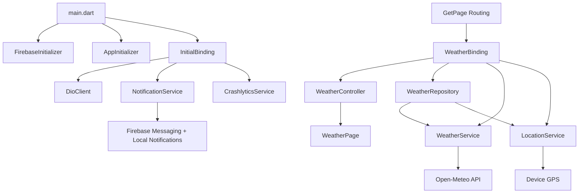

# Weather App

A Flutter application that demonstrates a clean GetX-based architecture, remote API integration, geolocation, Firebase Cloud Messaging, Crashlytics, and maintainable code structure.

This repository is intentionally organized as a strong interview-ready codebase: the architecture is easy to explain, the responsibilities are separated, and the app already shows production-minded practices such as error handling, logging, notification support, and environment-based configuration.

## Why This Project Matters

This project is useful as a technical portfolio piece because it shows:

- GetX for dependency injection, routing, and state management.
- Clear separation between presentation, domain-like repository logic, and data services.
- Real API integration through `Dio`.
- Location-based data fetching.
- Firebase integration for messaging and Crashlytics.
- Local notification support for foreground FCM messages.
- A code structure that is simple enough to maintain, but still scalable.

## Tech Stack

- Flutter
- GetX
- Dio
- Geolocator
- Firebase Core
- Firebase Messaging
- Firebase Crashlytics
- Flutter Local Notifications
- flutter_dotenv
- pretty_dio_logger

## Project Overview

The current app is a weather demo, but the repository is structured in a way that fits a larger product. The app shows how a Flutter engineer can build a clean foundation for a marketplace-style project, because the same patterns apply to:

- listing screens,
- detail screens,
- search and filtering,
- messaging,
- push notifications,
- and error monitoring.

## Architecture

The app uses a layered structure with GetX as the core framework.



### Layer Breakdown

#### 1. Presentation Layer

Located in `lib/features/weather/presentation/`.

This layer contains:

- `WeatherPage` for UI.
- `WeatherController` for state and user actions.
- UI widgets such as the search field and weather card.

Responsibilities:

- render the screen,
- react to user input,
- update UI state,
- and call the repository through the controller.

#### 2. Data Layer

Located in `lib/features/weather/data/`.

This layer contains:

- `WeatherRepository` as the main data orchestrator.
- `WeatherService` for API requests.
- `LocationService` for device location access.
- models such as `WeatherModel` and `CityModel`.

Responsibilities:

- fetch data from remote sources,
- fetch location from the device,
- convert raw JSON into typed models,
- and keep data access separate from UI.

#### 3. Core Layer

Located in `lib/core/`.

This layer contains shared infrastructure:

- `DioClient` for HTTP client setup.
- interceptors for logging and auth behavior.
- Firebase initialization helpers.
- notification handling.
- Crashlytics integration.

Responsibilities:

- centralize shared services,
- keep bootstrapping logic out of feature code,
- and make app-wide behavior easy to reuse.

#### 4. App Layer

Located in `lib/app/`.

This layer contains:

- route definitions,
- bindings,
- themes,
- and app-level visual constants.

Responsibilities:

- define navigation,
- register dependencies,
- and keep styling consistent.

## Dependency Injection Flow

GetX bindings are used to register dependencies in a predictable way.

- `InitialBinding` registers global services like `Dio`, `NotificationService`, and `CrashlyticsService`.
- `WeatherBinding` registers feature-level dependencies like repository, location service, weather service, and controller.

This keeps object creation centralized and avoids manual wiring inside UI widgets.

## Data Flow

### Current Weather

1. `WeatherPage` loads.
2. `WeatherController` requests current weather.
3. `WeatherRepository` asks `LocationService` for the current GPS position.
4. `WeatherService` fetches weather data from the Open-Meteo API.
5. The JSON response is converted into `WeatherModel`.
6. The UI rebuilds using `Obx`.

### City Search

1. User types a city name.
2. `WeatherController` calls `searchWeather()`.
3. `WeatherRepository` searches the city using geocoding.
4. The selected coordinates are used to fetch weather data.
5. The result is displayed in the UI.

### FCM and Banner Notifications

1. Firebase initializes at app startup.
2. `NotificationService` requests notification permission.
3. The FCM token is fetched and printed in debug console.
4. Foreground messages trigger `flutter_local_notifications`.
5. Android shows a high-priority banner-style notification.

## Features

### Existing Features

- Current weather based on device location.
- Search weather by city name.
- Pull-to-refresh for weather reload.
- FCM token logging for debugging.
- Foreground push notification banner support.
- Crashlytics integration hook.
- Debug HTTP logging in development mode.

### UX / UI Notes

The app currently uses a simple and readable Material 3 theme.
The structure is suitable for a Figma-driven workflow because:

- widgets are separated into small files,
- page layout is not tightly coupled to data fetching,
- theme constants are centralized,
- and the UI can be expanded without rewriting the architecture.

## Code Quality Practices

This repository is built to be maintainable and easy to hand over.

- Separation of concerns is respected.
- Reusable services live in `lib/core`.
- Feature code stays inside feature folders.
- Network calls go through a single `DioClient`.
- Debug-only logging is isolated behind `kDebugMode`.
- Firebase and notification bootstrapping happen before the app starts.
- Error reporting is wired through Crashlytics.

## Security and Operational Notes

The project already reflects a production-minded setup:

- environment values are loaded from `.env`,
- network logging is limited to debug builds,
- Firebase is initialized centrally,
- notification permissions are requested explicitly,
- and Android 13+ notification permission support is enabled.

If you want to make the repo even stronger for public demonstration, consider adding:

- unit tests for repository and controller logic,
- widget tests for the main weather screen,
- a CI workflow,
- and a short architecture decision log.

## Project Structure

```text
lib/
├── app/
│   ├── bindings/
│   ├── routes/
│   └── themes/
├── config/
├── core/
│   ├── firebase/
│   ├── network/
│   └── services/
├── features/
│   └── weather/
│       ├── bindings/
│       ├── data/
│       └── presentation/
├── firebase_options.dart
└── main.dart
```

## Main Entry Points

- `lib/main.dart` bootstraps Firebase, notification setup, and the app shell.
- `lib/core/app_initializer.dart` initializes shared services.
- `lib/app/bindings/initial_binding.dart` registers global dependencies.
- `lib/features/weather/bindings/weather_binding.dart` wires feature dependencies.

## How To Run

1. Install dependencies.

```bash
flutter pub get
```

2. Run the app in debug mode.

```bash
flutter run
```

3. If you want to verify code quality.

```bash
flutter analyze
```

## Android Notes

This project already includes the notification permission needed on newer Android versions.
For `flutter_local_notifications`, Android core library desugaring is enabled in:

- `android/app/build.gradle.kts`

That is required so the notification plugin can compile and run correctly.
